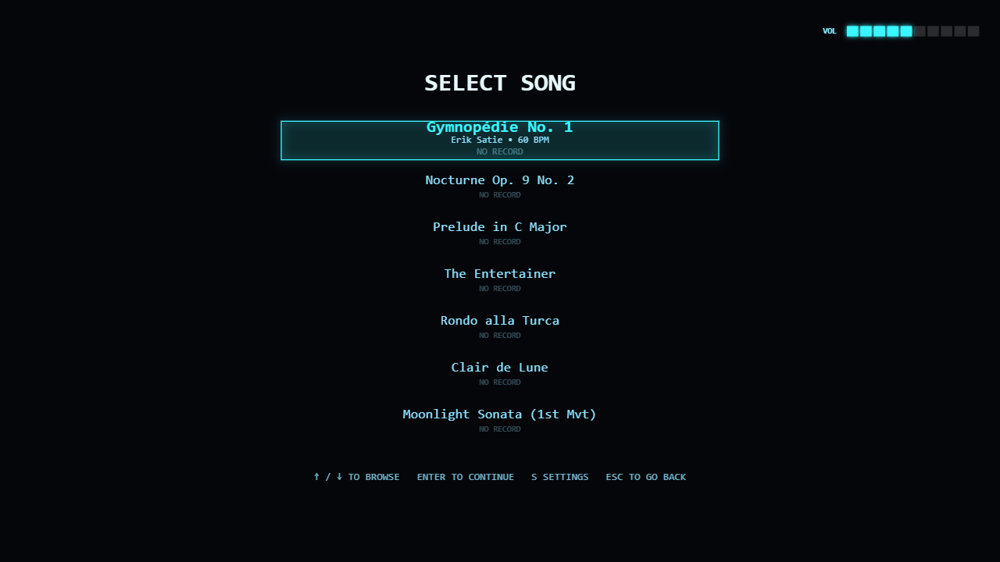
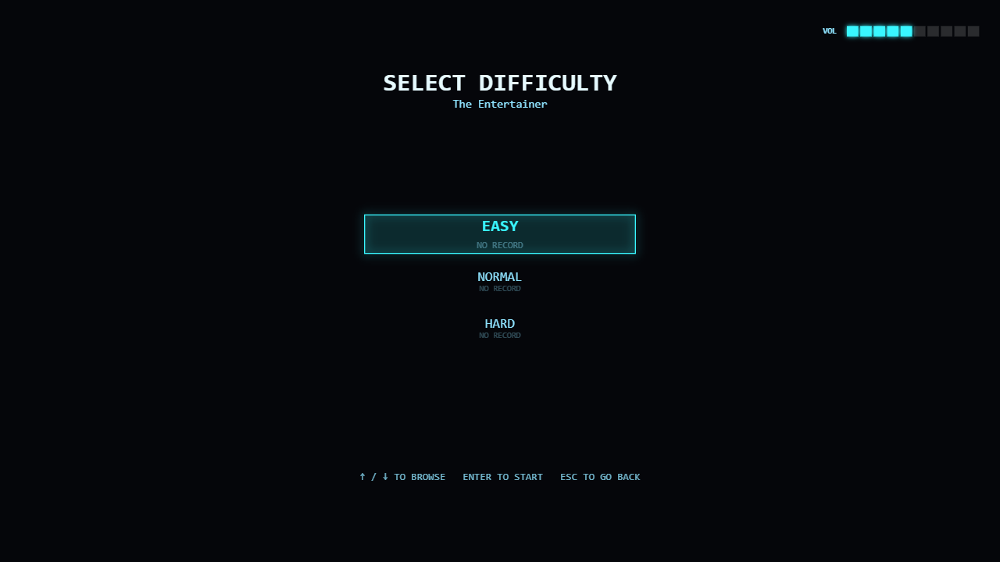
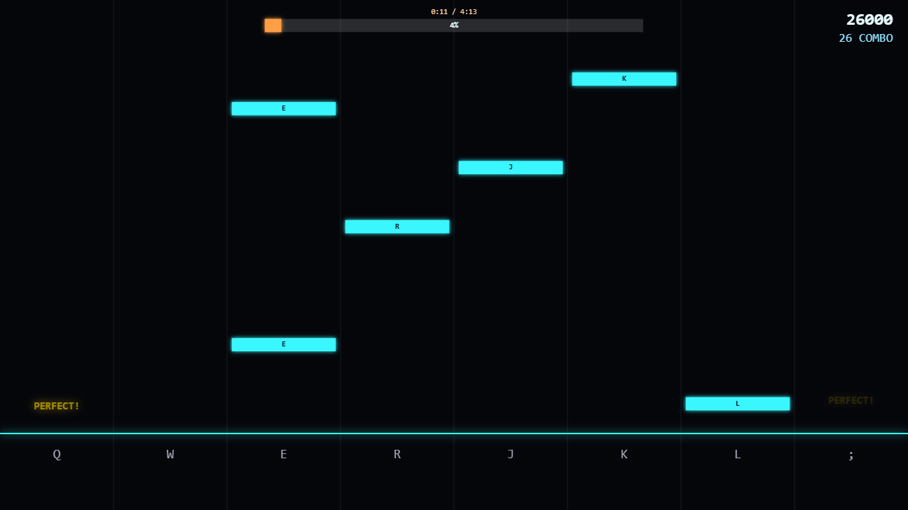
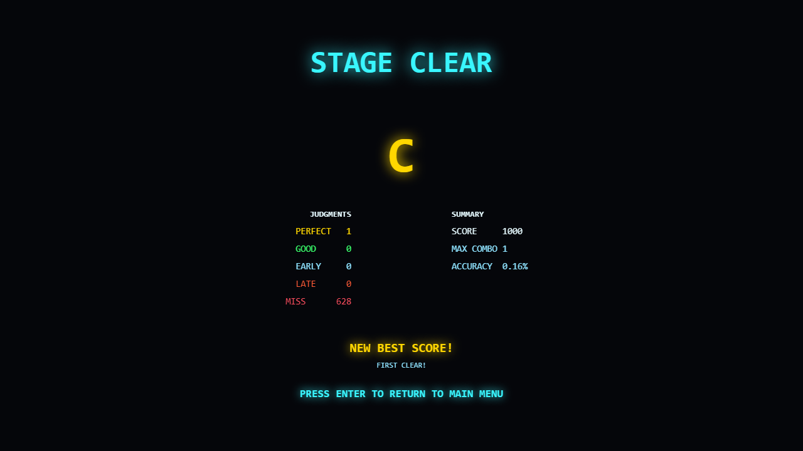

# Rhythm POC

[](https://chien521.github.io/rhythm_game/)
[](LICENSE)

**[▶ Play the live demo](https://chien521.github.io/rhythm_game/)** — no install needed, just click through the title screen (a click/keypress is required to unlock audio, per browser autoplay policy).

A high-performance, zero-drift Deemo-style vertical-fall rhythm engine built with Vite + TypeScript + Canvas 2D, purpose-built for deployment as an HTC VIVERSE widget.

All gameplay timing is anchored to the Web Audio API's hardware clock (`AudioContext.currentTime`) rather than `requestAnimationFrame` deltas or wall-clock time, so notes, hit judgments, and visual effects never drift out of sync with the music — even under heavy load, tab backgrounding, or a paused/resumed session. Rendering operates in a fixed 1920x1080 logical coordinate space that the renderer letterboxes/pillarboxes to fit whatever real window or widget frame it's embedded in, so the game looks and plays identically regardless of the host's aspect ratio.

There are no audio files: the game itself performs each song with a sampled piano (Salamander Grand, CC-BY), scheduling every note of a full performance JSON ("score") on the same `AudioContext` clock gameplay is judged against. Each song's playable chart is a thinned subset of that same score, so what you hear and what you're asked to hit can never drift apart — see [Content Pipeline](#content-pipeline) below.

## Screenshots

| Song Select | Difficulty Select |
|---|---|
|  |  |

| Gameplay | Results |
|---|---|
|  |  |

## Features

- **Zero-drift audio-clock timing** — every visual and judgment reads from `AudioContext.currentTime`, never a wall clock
- **7 songs**, each with 2-3 difficulty tiers (Easy/Normal, some also Hard) — see [the song list](#songs)
- **Hold notes** in addition to taps — press-and-hold notes rendered as a draining trail, scored once on completion
- **3-2-1 pre-game countdown** — the gameplay clock starts negative and rises to 0, so the first notes get a fair fall before they're hittable
- **Per-song, per-difficulty best scores**, persisted locally, shown on both the song list and results screen (with Full Combo / All Perfect badges)
- **Audio-offset calibration screen** with a live metronome (tick + synced visual flash) so you can dial in your device's output latency by ear
- **Full mouse + keyboard parity** everywhere — every menu is navigable either way, and the two can never resolve a selection differently
- **Developer Recording Mode** — tap out a new chart live against a song's actual audio instead of hand-authoring JSON timestamps

## Prerequisites

- [Node.js](https://nodejs.org/) 18+ and npm

## Installation & Local Development

```bash
npm install
npm run dev
```

This starts the Vite dev server (default `http://localhost:5173`). Open it in a browser and click/tap the title screen to begin — the first click is required to unlock the Web Audio API per browser autoplay policy.

## Production Build

```bash
npm run build
```

Type-checks (`tsc -b`) and builds optimized production assets into `/dist` via `vite build`. Use `npm run preview` to serve that build locally before deploying.

### Deploying to GitHub Pages

Every push to `main` runs [`.github/workflows/deploy-pages.yml`](.github/workflows/deploy-pages.yml), which builds the project and publishes `/dist` to GitHub Pages automatically — that's what powers the [live demo](https://chien521.github.io/rhythm_game/) link above. No manual `gh-pages` branch or build step needed; just push to `main` and the Actions run handles the rest (enable it once under the repo's **Settings → Pages → Source: GitHub Actions**).

### Building for VIVERSE

```bash
npm run build:viverse
```

Runs the same type-check + build, then packages everything into `viverse-prototype.zip` at the project root — with `index.html` sitting at the archive's immediate root (not nested inside a `dist/` folder), which is what VIVERSE Studio expects on upload.

### Other useful scripts

| Script | Purpose |
|---|---|
| `npm run build` | Type-check + production build only (no zip) |
| `npm run preview` | Preview the production build locally |
| `npm run parse:sheet -- <sheet> <id> "<Title>"` | Convert a MusicXML/MIDI piano sheet into a score JSON (`public/scores/`) |
| `npm run generate:chart -- <id> [flags]` | Thin a score into a playable chart (`public/charts/`) |
| `npm run validate:charts` | Verify every chart against its score (length + exact note onsets + hold integrity) |

## Songs

| Title | Artist | Difficulties |
|---|---|---|
| Gymnopédie No. 1 | Erik Satie | Easy, Normal |
| Nocturne Op. 9 No. 2 | Frédéric Chopin | Easy, Normal, Hard |
| Prelude in C Major | Johann Sebastian Bach | Easy, Normal |
| The Entertainer | Scott Joplin | Easy, Normal, Hard |
| Rondo alla Turca | Wolfgang Amadeus Mozart | Easy, Normal, Hard |
| Clair de Lune | Claude Debussy | Easy, Normal, Hard |
| Moonlight Sonata (1st Mvt) | Ludwig van Beethoven | Easy, Normal |

A song only ships a "Hard" tier when its source material actually has the note-density headroom to support one — a couple of pieces (Gymnopédie, the Bach Prelude, Beethoven's Moonlight) are already at or near their full score by Normal, so a "Hard" chart for those would just be a copy of Normal, and is intentionally omitted rather than shipped as filler.

## Gameplay

Notes fall vertically down 8 lanes toward a judgment line near the bottom of the screen. Input is entirely keyboard-driven, split across two rows for comfortable hand placement:

| Left hand | `Q` | `W` | `E` | `R` |
|---|---|---|---|---|
| **Lane** | 0 | 1 | 2 | 3 |

| Right hand | `J` | `K` | `L` | `;` |
|---|---|---|---|---|
| **Lane** | 4 | 5 | 6 | 7 |

- **Tap notes** — press the matching key the instant the note crosses the judgment line. Judged Perfect, Good, Early, or Late by how close the press lands to the note's exact time; a note that's never pressed in time is a Miss.
- **Hold notes** — rendered as a violet trail running from the head down to the tail; press at the head and keep the key held until the trail is fully consumed. Releasing early counts as a miss; holding through to (or very near) the end grades the whole hold as one judgment, same as a tap.
- **Slide notes** — no frame-perfect press required; just have the key held down (or press it) at any point within the note's window as it crosses the line, so you can roll your fingers across a run of notes.
- **Space** pauses/resumes during gameplay.
- Every song starts with a **3-2-1 countdown**: the gameplay clock starts a few seconds before 0 so the first notes already have room to fall before anything's hittable — no dropping straight into a note with no time to react.

**Focus-loss auto-pause:** if the browser tab/window loses focus, becomes hidden, or the app otherwise loses focus mid-song, playback automatically pauses and the current position freezes exactly. Regaining focus does **not** auto-resume — a "CLICK OR PRESS A KEY TO RESUME" prompt stays up until you explicitly re-engage, so tabbing back in never throws you back into gameplay unannounced.

The layout is also resize-safe: dragging/resizing the window (as a VIVERSE widget frame might be resized live) recalculates the letterbox instantly without resetting score, combo, or note timing.

## Controls by screen

| Screen | Controls |
|---|---|
| **Title** | `Enter` / click — go to Song Select |
| **Song Select** | `↑`/`↓` browse · `Enter` / click — play (or open Difficulty Select, if the song has more than one tier) · `←`/`→` volume · `M` mute · `S` open Settings · `R` start Recording Mode for the highlighted song · `Esc` back to Title |
| **Difficulty Select** | `↑`/`↓` browse tiers · `Enter` / click — start the run · `Esc` back to Song Select |
| **Settings** | `←`/`→` adjust the audio-offset calibration (a metronome tick + synced flash play live so you can dial it in by ear) · `Esc` or `S` — return to wherever you opened Settings from (Song Select or Paused) |
| **Gameplay** | `Q W E R` / `J K L ;` — hit lanes 0-7 · `Space` pause |
| **Paused** | `↑`/`↓` select · `Enter` confirm (Restart / Back to Menu) · `←`/`→` volume · `M` mute · `S` open Settings (returns to Paused) · `Space` resume |
| **Results** | `Enter` / click — return to Song Select |

## Content Pipeline

There are no audio files — the game itself performs each song, and every note the player is asked to hit is guaranteed to be a note the piano actually plays, because both derive from one committed source file per song:

```
sheets/<song>.mid or .musicxml   (committed sheet source — the single source of truth)
  │  npm run parse:sheet -- sheets/<file> <id> "<Title>"
  ▼
public/scores/<id>.json          full performance (every note the in-game piano plays)
  │  npm run generate:chart -- <id> [--target=2-4] [--hold-beats=1]
  ▼
public/charts/<id>.json          playable chart (a thinned subset of the score's exact onsets)
```

`generate-chart.js` thins note density in stages (velocity filter → per-hand cluster-merge → optional density auto-tune) and assigns each note's lane by pitch quantile within its hand, so lane usage stays balanced regardless of a piece's pitch range. A sustained note (≥ 1 beat, tempo-relative) becomes a hold instead of a tap. Thinning only ever *removes* notes or retypes tap→hold — it never invents a note that isn't an exact score onset, which is what `npm run validate:charts` enforces on every song before a chart ships.

## Developer Tools: Recording Mode

Recording Mode lets you map a new chart by tapping along to a song's actual audio in real time, rather than hand-authoring JSON timestamps.

**To record a new chart:**

1. From **Song Select**, highlight the song you want to record against and press **`R`**.
2. The track starts playing from the beginning. Tap along on any of the 8 lane keys (`Q W E R J K L ;`) in time with the music — each press is captured with its exact millisecond timestamp and confirmed with a bright flash on that lane.
3. Stop recording at any time by pressing **`Escape`**, or just let the track play to its end.
4. On stop, the tool:
   - Logs the complete chart JSON to the browser console.
   - Automatically downloads it as **`<songId>.json`**.

The exported file follows the same schema as the generated charts in `public/charts/`:

```json
{
  "meta": { "title": "Recorded Chart", "bpm": 120, "songLengthMs": 8000 },
  "notes": [
    { "id": "r1", "time": 1000, "x": 0, "type": "tap" }
  ]
}
```

All recorded notes are `"tap"` type — if you want `"hold"`/`"slide"` notes or a custom title/BPM, hand-edit the exported JSON afterward and drop it into `public/charts/` to use it as a new playable chart.

## License

The game's original source code is licensed under the [MIT License](LICENSE).

This does **not** cover:

- The **Salamander Grand Piano** samples (`public/samples/piano/`) — Creative Commons Attribution 3.0 (CC-BY) by Alexander Holm; see [`public/samples/piano/LICENSE.txt`](public/samples/piano/LICENSE.txt).
- The **sheet music sources** (`sheets/`) — public-domain scores from the [Mutopia Project](https://www.mutopiaproject.org), a free sheet-music archive. Every song in this repo (Satie, Chopin, Bach, Joplin, Mozart, Debussy, Beethoven) was sourced there as a public-domain MIDI transcription.
